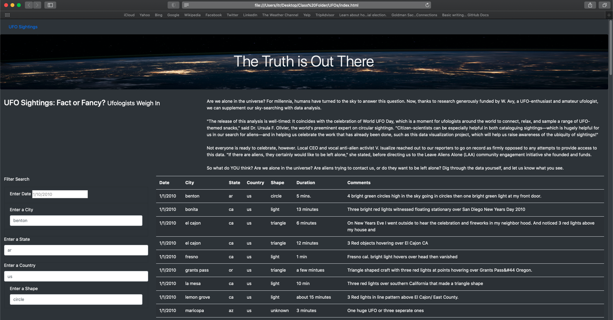

# UFOs

## Overview of Project
Hypothtically, this analysis is the brainchild of a UFO enthusiast who I follow along through her journey accessing and presenting UFO related data she found in a javascript file. This analysis looks at data stored in javascript related to UFOs and packages it for an interested audience.

However, that is simply the pre-text for the guided learning activity which culminates in this project. In this repository, I built a table using data stored in a JavaScript array. Then I created filters to make the aforementioned table fully dynamic, meaning that that it will react to user input, and then place the table into an HTML file for easy viewing. Finally I customized the webpage using Bootstrap, and equipped the table with several fully functional filters that will allow users to interact with my visualizations.

## Results
_Describe to Dana how someone might use the new webpage by walking her through the process of using the search criteria. Use images of your webpage during the filtering process to support your explanation._

### Webpage Demo

## Summary
One drawback of this webpage is that it is hosted locally. Given my novice experience with building webpages, bear with me while I elaborate. In order to filter the table and access the information, the index file, css file, both javascript files, and the image used herein must be downloaded to get the full experience. A fully functional webpage could be accessed with just the name of a webpage. Imagine trying to use any site, maybe facebook or amazon, and having to download and organize every page you wanted to use...exactly, people would try, get frustrated, and leave and that is if they tried at all. With all that said, for a tech savy community such as this, this webpage can afford the extraterrestrially inclined a novel pleasure. 

While this page is functional for an interested audience, I think a general audience might be more interested in general trends which this project does not offer by way of graphs (ex. pie chart with citings per country) or quick facts (ex. "most alien citings are in X month, in Y country"). Second to that, it does not allow the table, filtered or unfiltered to be exported. I would recommend that graphs be added and the table be made exportable to further develop this webpage.

